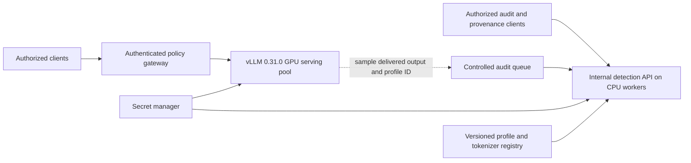

# vLLM 0.31.0 watermarking runbook

Prepared for the JPMC serving team on 8 October 2026. This document targets **vLLM 0.31.0** and text output from models such as **`google/gemma-4-31B-it`**. It records the tests completed in this workspace and provides deployment instructions and proposed enterprise controls. The controls are recommendations for team review, not a statement of existing JPMC policy or a compliance certification.

**Recommended initial deployment:** Gumbel watermarking, Philox, context width 4, default completion-context deduplication, no speculative decoding, an approved stochastic sampling profile, and an internal detector. Make watermarking mandatory through the serving gateway and deployment checks. vLLM's enable flag alone does not enforce that policy.

**Validation boundary:** watermarking was exercised on OPT-125M and synthetic token distributions. Gemma 4 31B has not been loaded or benchmarked in this workspace. The Gemma command-line configuration was parser-checked; the serving team must run model-specific quality, detection, capacity, and gateway acceptance tests before production.

## 1. What vLLM enables and what it does not enforce

| Situation | v0.31.0 behavior |
|---|---|
| Server omits `--watermark-config` | Watermark generation is **off**. A client cannot enable it merely by sending `watermarking: true`. |
| Server supplies a valid watermark configuration; request omits `watermarking` | Watermarking is **on by default** for supported stochastic generation. |
| Request sends `"watermarking": true` | Uses the server's configured algorithm and key. |
| Request sends `"watermarking": false` | **Opts out**, even when the server has watermarking configured. |
| Request uses `temperature=0` | Ordinary greedy decoding; no watermark, with a warning once per worker. |
| Repeated context under default deduplication | Uses ordinary sampling at that occurrence. The detector does not count duplicate contexts as independent evidence. |
| Beam search or a model-specific custom sampler | Unsupported with configured watermarking; validation rejects these combinations. |
| Desired server flag that prohibits client opt-out | v0.31.0 has **no dedicated mandatory-watermark flag**. Add enforcement at ingress or maintain an audited server-side policy extension. |

These statements are specific to v0.31.0. Its Python chat/completion request schemas and `SamplingParams` use a boolean `watermarking` field defaulting to `True`; do not substitute behavior from newer documentation. The algorithm and key are engine-level settings, not supported per-request key choices. Configuring watermarking selects Model Runner V2 automatically.

Sources: [release watermark documentation](https://docs.vllm.ai/en/v0.31.0/features/watermarking/), [configuration](https://github.com/vllm-project/vllm/blob/v0.31.0/vllm/config/watermarking.py), [GPU sampler](https://github.com/vllm-project/vllm/blob/v0.31.0/vllm/v1/watermarking/gpu_sampler.py), and [chat request schema](https://github.com/vllm-project/vllm/blob/v0.31.0/vllm/entrypoints/openai/chat_completion/protocol.py).

The default `gumbel` algorithm makes sampling randomness reproducible from the secret key, previous generated tokens, and candidate token ID. Detection reconstructs that signal without model weights. It is statistical evidence associated with a known watermark profile, not a general detector of all AI text. A negative result does not establish human authorship.

## 2. Tests completed on vLLM 0.31.0

### Environment and provenance

| Component | Recorded value |
|---|---|
| Virtual environment | `.venv` |
| Python | 3.12.13 |
| vLLM | 0.31.0, installed release wheel |
| Source checkout | `upstream-vllm`, tag `v0.31.0` |
| Source commit | `db9527a46873454610df6dbedf79a36d6bf1a7f6` |
| PyTorch | `2.13.0+cu132` |
| GPU | NVIDIA RTX PRO 6000 Blackwell Server Edition, approximately 96 GiB |
| NVIDIA driver | 580.126.16 |
| Dependency records | [requirements.txt](requirements.txt), [requirements-lock.txt](requirements-lock.txt) |

The probe compared 12 watermark configuration, algorithm, detector, PRF, and kernel source files in the installed wheel with the release checkout. **All 12 matched byte-for-byte.** The dependency snapshot records this particular CUDA installation; it is not a universal lockfile for every accelerator. Use a qualified image/runtime combination for the target hardware.

### Upstream unit and GPU tests

Result: **97 passed, 14 deprecation warnings, 41.99 seconds.** The warnings concerned PyTorch's deprecated `torch.jit.script_method`. No test was skipped or failed in this selected v0.31.0 run.

Coverage included PRF compatibility vectors; CPU/GPU agreement; fused sampling, noncontiguous inputs and mixed opt-out masks; detector scores and context deduplication; greedy bypass; context construction and history windows; and dual-key draft/target role wiring.

Run from the workspace root:

```bash
.venv/bin/python -m pytest --import-mode=importlib \
  --confcutdir=upstream-vllm/tests/watermarking \
  upstream-vllm/tests/watermarking/test_gumbel.py \
  upstream-vllm/tests/watermarking/test_prf.py \
  upstream-vllm/tests/watermarking/test_detection.py \
  upstream-vllm/tests/watermarking/test_watermarking.py -q
```

`--import-mode=importlib` uses the installed wheel instead of accidentally importing the unbuilt checkout. `--confcutdir` excludes unrelated parent model-test fixtures. The recorded run did not include the full repository suite, `test_goldens.py`, or the upstream engine-level E2E test file. The separate model probe below exercised the engine. [Recorded test log](upstream-tests.log).

### Synthetic sampling and detection

```bash
.venv/bin/python investigate_watermark.py \
  --source-dir upstream-vllm --output-dir validation-v031-rerun
```

The script checked CPU/GPU equality on 32 rows with an 8,193-token vocabulary. A separate 100,000-draw probe used probabilities `[0.1, 0.2, 0.3, 0.4]`; observed frequencies were `[0.09988, 0.20152, 0.29888, 0.39972]`.

For a 128-token synthetic watermarked sequence, the matching-key p-value was `8.50e-178`, versus `0.7743` with the wrong key. An ordinary random sequence returned `0.4799`. These are illustrative checks, not measured production false-positive or detection rates. [Recorded results](investigation-results.json).

The probe also confirmed that the dual-key detector uses an approximate Gamma calibration for unequal weights: with 32 independent ideal-null scores and detector weight 0.2, a nominal 1% threshold had a calculated null tail of approximately 1.058%. That calculation is not a traffic-based false-positive measurement.

### Real model generation and detection

```bash
.venv/bin/python investigate_watermark.py \
  --model facebook/opt-125m --output-dir validation-v031-rerun
```

Configuration: `key=42`, context width 4, generation seed 0, eager execution, maximum model length 512, maximum output 256 tokens, and one story prompt. Non-greedy cases used temperature 1.0. Generation could end at EOS before 256 tokens.

| Case | Generated tokens | Matching-key p-value | Result at threshold 0.01 |
|---|---:|---:|---|
| Watermark enabled | 23 | `9.83297e-20` | Detected |
| Explicit opt-out | 168 | `0.0552364` | Not detected |
| Greedy decoding | 256 | `0.990365` | Not detected; only 50 unique contexts scored |
| Watermarked output checked with key 43 | 23 | `0.726069` | Not detected |

Decoding and retokenizing the watermarked text retained detection: `p=1.29546e-19`, with 22 scored tokens. The generated-token and visible-text counts differ because special tokens may not appear in the returned text. [Model results](model-results.json), [engine log](model-probe.log), [reproduction script](investigate_watermark.py).

### Additional checks while preparing this runbook

The unmodified upstream detection HTTP server was started locally with the OPT tokenizer, key 42, and port 18001. POSTing the three saved completion texts to `/detect` reproduced the in-process retokenized results exactly: watermarked `1.29546e-19`, opt-out `0.0522826`, greedy `0.990365`. [HTTP results](validation-v031-docs/detector-http-results.json).

The v0.31.0 argument parser accepted the Gemma serving settings below from YAML, including nested `watermark-config`, and preserved a public test integer of `2**64-1` exactly. This check did not load Gemma or start its engine. [Parser results](validation-v031-docs/config-parser-results.json).

These tests do not establish Gemma quality, throughput overhead, edit robustness, multilingual calibration, production security, or full-model speculative-decoding correctness.

## 3. Basic local testing

The public key **42 is only for reproducible tests**. The following services bind to localhost and are not enterprise ingress examples.

### Install or activate the pinned environment

In this workspace, `.venv` already contains v0.31.0:

```bash
source .venv/bin/activate
python -c 'import vllm; assert vllm.__version__ == "0.31.0"; print(vllm.__version__)'
```

For a new workspace, create the environment and obtain the matching examples/tests:

```bash
uv venv --python 3.12 .venv
uv pip install --python .venv/bin/python -r requirements.txt --torch-backend=auto
git clone --depth 1 --branch v0.31.0 \
  https://github.com/vllm-project/vllm.git upstream-vllm
```

Only run the clone when that destination does not already exist. Enterprise builds should use approved package/artifact mirrors, pin the image digest and model revision, and retain the resolved dependency manifest. Do not replace the pinned release with a nightly image from an older model recipe.

### Start a small generation server

Terminal A:

```bash
.venv/bin/vllm serve facebook/opt-125m \
  --served-model-name watermark-test \
  --host 127.0.0.1 --port 8000 \
  --max-model-len 512 --gpu-memory-utilization 0.20 \
  --enforce-eager \
  --watermark-config '{"algorithm":"gumbel","key":42,"context_width":4,"prf":"philox"}'
```

Terminal B, after `GET /health` succeeds:

```bash
curl --fail-with-body http://127.0.0.1:8000/v1/completions \
  -H 'Content-Type: application/json' \
  -d '{
    "model":"watermark-test",
    "prompt":"Tell me a story about an explorer who discovers a mysterious island.",
    "temperature":1.0,
    "max_tokens":256,
    "seed":0,
    "watermarking":true
  }' > local-generation.json
```

OPT is used with `/v1/completions` because it is not a chat-template example. `--enforce-eager` simplifies debugging; it is not required for watermarking and is not the production performance recommendation.

### Start the upstream detector and check the response

Terminal C:

```bash
.venv/bin/python upstream-vllm/examples/basic/online_serving/watermark_detection_server.py \
  --tokenizer facebook/opt-125m \
  --key 42 --prf philox --context-width 4 \
  --p-value-threshold 0.01 \
  --host 127.0.0.1 --port 8001
```

Terminal B:

```bash
.venv/bin/python - <<'PY'
import json
from pathlib import Path
response = json.loads(Path("local-generation.json").read_text())
text = response["choices"][0]["text"]
Path("local-detection-request.json").write_text(json.dumps({"text": text}))
PY
curl --fail-with-body http://127.0.0.1:8001/detect \
  -H 'Content-Type: application/json' \
  --data-binary @local-detection-request.json
```

Repeat generation with `"watermarking": false` and then with `"temperature": 0`. The first disables watermarking; the second bypasses it. A particular unwatermarked sample can still cross a statistical threshold, so do not expect zero false positives from every negative-control request.

The upstream detector responds with `score`, `p_value`, `num_scored_tokens`, and `is_watermarked`. It is a separate process; `vllm serve` does not install this example's `/detect` route. Keep the generation and detector ports different.

## 4. Serving Gemma 4 31B IT

The exact repository name is **`google/gemma-4-31B-it`**, including uppercase `B`. The official model card recommends temperature 1.0, top-p 0.95, and top-k 64. The upstream serving recipe includes a two-GPU BF16 deployment. Use this as a capacity starting point, then measure actual context length, concurrency and latency. [Google model card](https://huggingface.co/google/gemma-4-31B-it), [vLLM Gemma recipe](https://docs.vllm.ai/projects/recipes/en/stable/Google/Gemma4.html).

The example below assumes two suitable 80 GiB GPUs, a verified model/tokenizer revision, and a text-only API policy. It limits context length to 8,192 and active sequences to 16 for initial testing. Those are proposed operating settings, not benchmarked capacity guarantees. Download the approved model snapshot in advance or arrange Hugging Face access under your artifact policy.

```bash
# Set this to the full, reviewed model-repository commit before execution.
export GEMMA_REVISION='REPLACE_WITH_APPROVED_FULL_COMMIT'

.venv/bin/vllm serve google/gemma-4-31B-it \
  --revision "$GEMMA_REVISION" \
  --tokenizer-revision "$GEMMA_REVISION" \
  --served-model-name gemma4-31b-watermarked \
  --host 127.0.0.1 --port 8000 \
  --dtype bfloat16 --tensor-parallel-size 2 \
  --max-model-len 8192 --max-num-seqs 16 \
  --gpu-memory-utilization 0.90 \
  --generation-config vllm \
  --override-generation-config '{"temperature":1.0,"top_p":0.95,"top_k":64}' \
  --reasoning-parser gemma4 \
  --default-chat-template-kwargs '{"enable_thinking":false}' \
  --watermark-config '{"algorithm":"gumbel","key":42,"context_width":4,"prf":"philox","deduplicate_contexts":"single_turn","deduplicate_contexts_max_history":8192,"allow_target_only_watermarking":false}'
```

This is the **local test command**. Replace the public-key CLI argument with the secret-file configuration in section 5 before enterprise deployment. For a container exposed only to an internal Service, bind `0.0.0.0` inside the container and restrict reachability with the network policy described in section 6.

`--generation-config vllm` plus explicit overrides makes the intended defaults visible. These defaults are still client-overridable; they do not enforce the gateway policy. The initial profile disables thinking and omits tools and speculative decoding to simplify validation. The model's chat template and reasoning parser are part of the release profile and must be tested together.

Call the chat endpoint:

```bash
curl --fail-with-body http://127.0.0.1:8000/v1/chat/completions \
  -H 'Content-Type: application/json' \
  -d '{
    "model":"gemma4-31b-watermarked",
    "messages":[{"role":"user","content":"Write a detailed explanation of how rain forms, in several paragraphs."}],
    "temperature":1.0,
    "top_p":0.95,
    "top_k":64,
    "max_tokens":512,
    "watermarking":true,
    "chat_template_kwargs":{"enable_thinking":false}
  }' > gemma-generation.json
```

With the OpenAI Python client, vLLM extension fields go in `extra_body`:

```python
from openai import OpenAI

client = OpenAI(base_url="http://127.0.0.1:8000/v1", api_key="EMPTY")
response = client.chat.completions.create(
    model="gemma4-31b-watermarked",
    messages=[{"role": "user", "content": "Explain how rain forms in several paragraphs."}],
    temperature=1.0,
    top_p=0.95,
    max_tokens=512,
    extra_body={
        "top_k": 64,
        "watermarking": True,
        "chat_template_kwargs": {"enable_thinking": False},
    },
)
print(response.choices[0].message.content)
```

`api_key="EMPTY"` is for this unauthenticated localhost example. It is not an enterprise authentication configuration. A client can put `False` in the same extension field to opt out unless the gateway blocks it.

### Connecting a Gemma assistant application

**Scope assumption:** “Gemma assistant” here means a chat or agent application backed by Gemma 4. The team's actual application/framework and version still need to be identified. These instructions define its integration contract; they are not product-specific UI instructions. If “assistant” means a speculative draft model, use section 8 and validate the particular drafter separately.

Deploy the generation service above behind the mandatory-policy gateway in section 6. Configure the assistant's server-side model adapter as follows:

| Assistant setting | Value or requirement |
|---|---|
| API/provider adapter | OpenAI-compatible **Chat Completions**, calling `/v1/chat/completions`. Conversation storage, retrieval and tool execution remain in the assistant application. This recipe does not depend on an Assistants API. |
| Base URL | The approved internal gateway URL ending in `/v1`; direct access to the vLLM engine must be denied. |
| Model | `gemma4-31b-watermarked`, matching `--served-model-name`. |
| Authentication | The application's gateway credential or workload-identity integration. Keep credentials in the backend. |
| Sampling | Temperature `1.0`, top-p `0.95`, top-k `64`, subject to the approved profile. Override framework defaults that request temperature `0`. |
| Request extensions | `watermarking: true` and `chat_template_kwargs: {"enable_thinking": false}`. Use the adapter's extra-body/custom-JSON facility. Confirm that the outgoing HTTP body preserves these fields. |
| Watermark key | No key in the assistant prompt, browser, or client request. Only generation and detection services receive it through the secret-management path. |
| User settings | Expose only approved model and sampling choices. The gateway enforces the policy even if the UI has no watermark toggle. |

If the adapter cannot forward extension fields, let the gateway inject the approved settings after validating the request. An omitted `watermarking` field defaults to enabled on a configured engine, but omission alone is not enforcement. A system instruction such as “always watermark your answer” cannot activate the sampler or prevent an API-level opt-out.

The following minimal backend example keeps ordinary conversation history and uses the same sampling profile on every turn. Set `GEMMA_ASSISTANT_BASE_URL` to the approved gateway URL and provide `GEMMA_ASSISTANT_API_KEY` through the application's credential mechanism. Run it with `.venv/bin/python` after deploying the gateway and model:

```python
import os
from openai import OpenAI

client = OpenAI(
    base_url=os.environ["GEMMA_ASSISTANT_BASE_URL"],
    api_key=os.environ["GEMMA_ASSISTANT_API_KEY"],
)
history = [{"role": "system", "content": "Answer clearly and explain uncertainty."}]

def answer(user_text):
    messages = history + [{"role": "user", "content": user_text}]
    response = client.chat.completions.create(
        model="gemma4-31b-watermarked",
        messages=messages,
        temperature=1.0,
        top_p=0.95,
        max_tokens=512,
        extra_body={
            "top_k": 64,
            "watermarking": True,
            "chat_template_kwargs": {"enable_thinking": False},
        },
    )
    choice = response.choices[0]
    if choice.finish_reason != "stop" or not choice.message.content:
        raise RuntimeError("Incomplete or non-text answer; handle before delivery")
    final_text = choice.message.content
    history[:] = messages + [{"role": "assistant", "content": final_text}]
    return final_text

print(answer("Explain how rain forms in several paragraphs."))
print(answer("How does that explanation change in a cold climate?"))
```

This is an integration example, **not a completed Gemma inference test**. In the application, isolate history by conversation/user and budget the rendered prompt plus requested output within the configured context limit. Send ordinary `system`, `user`, and `assistant` messages; let the pinned server chat template encode Gemma's control tokens. Consolidate application instructions into the initial system message. Do not pre-render a Gemma prompt and then send it through chat templating again. Gemma 4 supports a system turn in its [documented prompt format](https://ai.google.dev/gemma/docs/core/prompt-formatting-gemma4).

Apply the gateway policy to every model call that can contribute generated text to a delivered answer: retries, RAG synthesis, conversation summaries that are displayed, tool-follow-up answers, translations, and final rewrites. Route fallback models through an approved watermarked profile and record which profile actually produced each output. Do not silently fall back to an unconfigured model. Retrieved passages, tool results and application-added text do not become watermarked merely by appearing beside a generated answer.

### Assistant tools, thinking, streaming and detection

The initial profile above is plain text with thinking disabled. If the assistant requires tools, qualify a separate profile and update the gateway allowlist. Add the following options to the section 4 serving command, retaining its watermark/secret configuration, pinned revisions and sampling settings:

```bash
  --enable-auto-tool-choice \
  --tool-call-parser gemma4 \
  --chat-template upstream-vllm/examples/tool_chat_template_gemma4.jinja
```

These are **additional arguments**, not a standalone shell command. Package this template from the pinned v0.31.0 checkout into the serving image and use its actual container path. Keep `--reasoning-parser gemma4`. Review and pin template changes as part of the watermark profile. The [v0.31.0 Gemma tool template](https://github.com/vllm-project/vllm/blob/v0.31.0/examples/tool_chat_template_gemma4.jinja) handles tool definitions, assistant tool calls, and subsequent tool results.

Use the Chat Completions `tools` schema and `tool_choice="auto"` through the approved adapter. Append the returned assistant message with its `tool_calls`, validate and execute permitted functions in the application, then append each result as a `role="tool"` message with the matching `tool_call_id` and string content. Call the model again with the same watermark profile to obtain the final answer. Preserve the call/result pairing when trimming history. Tool execution and authorization belong to the application; vLLM only generates the requested calls. Short or constrained tool arguments need their own evaluation and are not evidence that the final answer will be detectable.

If thinking is needed, enable it only in a separately evaluated profile using `chat_template_kwargs={"enable_thinking": true}` (and matching server defaults if appropriate). Preserve reasoning across tool calls within the same model turn; remove raw reasoning from completed turns before the next ordinary user turn. The adapter must preserve the reasoning field expected by the pinned template rather than flattening it into visible answer text. Keep reasoning out of customer-facing detection payloads. These conversation rules follow [Google's Gemma guidance](https://ai.google.dev/gemma/docs/core/prompt-formatting-gemma4); thinking and tool modes have **not** been validated for final-answer watermark detection in this workspace.

For streaming, concatenate the final-answer `delta.content` chunks in order and evaluate the completed text. A chunk boundary is not a watermark boundary. Keep reasoning and tool-call deltas separate. Detect each delivered assistant answer using section 7's service; do not send the whole conversation or prepend the system prompt. Record the request ID, generation/profile identity and delivery transformations with the result. If an answer is assembled from several model generations, retain the segment boundaries for diagnostics and calibrate detection on the assembled output separately.

Include short acknowledgments, long answers, follow-up turns, retrieved quotations, tool cycles, cancellations, retries, failover, and redacted/rendered text in assistant acceptance testing. A short answer can have insufficient evidence even when watermarking was enabled. If policy requires a detection decision **before** release, buffer the answer and gate delivery; an asynchronous audit cannot enforce that decision on text already streamed to the user.

## 5. Keys and watermark profiles

### Basic local key generation

The current Philox implementation accepts an **unsigned 64-bit integer**, from 0 through `2**64-1`. The watermark key is separate from a request's sampling seed and from an API authentication credential. `secrets.randbits(64)` uses the operating system's secure random source; do not use timestamps, names, sequential IDs, or `random.seed` to construct enterprise keys.

This creates a new key directly in a private YAML file, without printing it or placing its value in a shell argument. Run once; exclusive creation deliberately prevents overwriting an existing key:

```bash
umask 077
.venv/bin/python - <<'PY'
import os
import secrets
from pathlib import Path
import yaml

directory = Path(".watermark-secrets")
directory.mkdir(mode=0o700, exist_ok=True)
directory.chmod(0o700)
path = directory / "watermark.yaml"
config = {
    "watermark-config": {
        "algorithm": "gumbel",
        "key": secrets.randbits(64),
        "prf": "philox",
        "context_width": 4,
        "deduplicate_contexts": "single_turn",
        "deduplicate_contexts_max_history": 8192,
        "allow_target_only_watermarking": False,
    }
}
fd = os.open(path, os.O_WRONLY | os.O_CREAT | os.O_EXCL, 0o600)
with os.fdopen(fd, "w") as stream:
    yaml.safe_dump(config, stream, sort_keys=False)
print("Created private configuration:", path)  # No key value printed.
PY
```

Keep `.watermark-secrets/` out of version control, shared folders, images, and diagnostic bundles. This directory has **not** been created by the documentation work. For local generation, replace the entire `--watermark-config '...'` argument with:

```bash
--config .watermark-secrets/watermark.yaml
```

vLLM's YAML loader accepts nested `watermark-config`. It does not require the key on the OS command line. CLI arguments override YAML, so the enterprise deployment controller must prevent unreviewed argument overrides. vLLM does not automatically resolve secret-manager references in this field.

### Enterprise key lifecycle

Use your approved secret manager and workload identity to provision the same active key to authorized generators and detectors. Generate it once for the chosen service/environment/tenant scope and key epoch; do not generate a fresh key each time a replica starts. Replicas of one profile should agree on the key. Separate nonproduction and production keys and separate tenant keys where isolation requirements justify it.

Mount a read-only secret file such as `/run/secrets/watermark/watermark.yaml` through the platform's secret integration. Start the pinned vLLM container with the same model arguments and **`--config /run/secrets/watermark/watermark.yaml`**. Restrict file/process access and suppress shell tracing and configuration dumps. vLLM masks watermark configuration in its standard argument log, but that is not a guarantee about surrounding launchers, crash dumps, or observability agents.

Do not put real keys in Helm values committed to Git, ConfigMaps, image layers, notebook output, tickets, client requests, or detector responses. A Kubernetes Secret also needs appropriate RBAC and encryption-at-rest/platform secret controls. Encrypting a key under a KMS/HSM protects storage and provisioning; this implementation still needs the actual key in the serving process and GPU computation.

Maintain a separate **non-secret profile identifier**, for example `gemma4-31b-prod-2026q4-k01`, linked to:

- Immutable model and tokenizer revisions, tokenizer file hashes, chat template and output parsing rules.
- vLLM image digest/version, algorithm, PRF name and version (`philox4x32-10-v1`), context width, generation deduplication scope/window, and sampling profile.
- Secret-manager key reference/version, activation and retirement times, authorized serving pool, and detector version.
- Detector threshold, minimum evidence policy, calibration dataset/version, and multiple-profile testing policy.

This profile ID is application metadata; vLLM does not embed it as a recoverable payload or automatically return it as a watermark receipt. Have the gateway/audit layer attach it to retained provenance records. Store 64-bit values without conversion through JavaScript floating-point numbers: a decimal string is suitable in a registry, converted to a Python integer when constructing vLLM's config.

Rotate through a rolling deployment with a new profile/key version, validate it, then retire the old generation pool. Record which profile served each response. Keep historical keys available to the authorized detector for the required retention period. Deleting an old key prevents later verification with that key. Compromise requires a new key/profile and a recorded trust cutoff; it does not retroactively make old evidence reliable.

**Cryptographic limit:** secure key generation does not make Philox a cryptographic PRF. v0.31.0's watermark is not a cryptographic signature and does not promise resistance to key recovery or forgery. It cannot be upgraded to a 256-bit cryptographic watermark just by supplying a larger integer. For stronger provenance, combine the statistical mark with authenticated audit records and, where appropriate, signed content/provenance metadata using the organization's approved cryptographic systems. [PRF implementation](https://github.com/vllm-project/vllm/blob/v0.31.0/vllm/v1/watermarking/prfs/philox.py).

## 6. Making watermarking mandatory at the service boundary

Interpret mandatory as **every admitted request uses an approved watermarked generation profile**. It cannot mean that every token is marked or every answer is statistically detectable. Deduplication deliberately skips some tokens; short, repetitive, heavily constrained, or near-deterministic outputs may have little evidence even with watermarking enabled.

Recommended initial gateway policy:

1. Expose only approved model aliases and routes. Authenticate and authorize callers, and block direct access to the vLLM service. Apply the policy to streaming and nonstreaming requests and to every replica/failover destination.
2. Strictly validate JSON types and reject duplicate/conflicting fields. Accept `watermarking` only when omitted or literal `true`; reject `false`, `null`, strings and numbers. Forward canonical `watermarking: true` after validation.
3. Require the approved stochastic sampling profile. Initially accept omitted settings or the approved values `temperature=1.0`, `top_p=0.95`, `top_k=64`, and forward explicit values. Reject greedy decoding and unauthorized overrides. Merely checking `temperature > 0` is insufficient: top-k 1, narrow allowed-token lists, extreme biases, or restrictive grammars can eliminate the useful sampling freedom.
4. Reject beam search and unapproved `min_p`, logit biases, allowed-token lists, custom processors, grammar/structured-output modes, tools, or thinking settings until each has an evaluated profile. Use an allowlist appropriate to the supported API, including chat-template options. Support those features later through tested profiles rather than blanket claims about detectability.
5. Verify the secret and watermark config before starting each engine. Keep a replica out of service on missing/invalid configuration or a failed known-answer detector check. At rollout, run controlled generation/detection canaries; monitor their aggregate behavior, not an expectation that every arbitrary answer must pass a detector.
6. Record model/profile ID, effective sampling settings, request ID and policy decisions without logging secret values. Treat a greedy-bypass warning as an operational signal, but do not count warnings as a per-request audit: the warning is emitted only once per worker.

Do not treat `--api-key` as the enforcement mechanism. It authenticates selected endpoint prefixes; v0.31.0 also exposes routes outside those prefixes. Block unapproved paths such as alternative inference, batch, token, gRPC, or administrative entrypoints at the network/gateway boundary. Authentication alone does not remove client opt-out. [Frontend authentication scope](https://github.com/vllm-project/vllm/blob/v0.31.0/vllm/entrypoints/launchers/cli_args.py).

A deployment starting without its secret must fail closed, rather than omit `--watermark-config` and start an unwatermarked fallback. The examples in this document **do not implement a gateway**; the serving team must implement and test that enforcement.

If a product requires a positive detection result before release of each answer, it must buffer the answer, apply a separate decision policy, and withhold or handle insufficient evidence. That requirement is incompatible with immediately releasing unchecked streaming chunks. Do not silently retry until a detector is positive: selection changes the statistics and requires its own evaluation.

### EU AI Act context

Article 50(2) addresses machine-readable marking and detectability of synthetic outputs by covered providers, with technical-feasibility qualifications and exceptions. It does not prescribe this particular vLLM algorithm or say that turning on a flag establishes compliance. Article 50 also contains separate transparency/disclosure duties. [Official Article 50 text](https://ai-act-service-desk.ec.europa.eu/en/ai-act/article-50).

The Commission's current FAQ states that Article 50 applies from 2 August 2026, with a limited Article 50(2) transition until 2 December 2026 for systems placed on the market before 2 August 2026. Have JPMC Legal/Compliance determine the applicable role, system dates, exceptions, and disclosure obligations. Mandatory watermarking is a proposed technical policy that supports that assessment; effectiveness evidence and complementary provenance controls remain necessary. [Commission FAQ](https://digital-strategy.ec.europa.eu/en/faqs/transparency-obligations-under-article-50-ai-act).

## 7. Detection service and enterprise hosting

### What vLLM ships

The release includes [GumbelWatermarkDetector and DualKeyGumbelWatermarkDetector](https://github.com/vllm-project/vllm/blob/v0.31.0/vllm/v1/watermarking/gumbel.py), plus the [minimal FastAPI detection server](https://github.com/vllm-project/vllm/blob/v0.31.0/examples/basic/online_serving/watermark_detection_server.py) used in section 3.

The example server supports **single-key `gumbel` only**, with tokenizer, key, context width, PRF and threshold arguments. It has no built-in authentication, profile/key registry, key rotation, request-size limit, minimum-evidence policy, or readiness endpoint. Its `--key` appears in process arguments. It initializes module globals in `main()`: run it with `python .../watermark_detection_server.py`; do not assume that importing `module:app` into a multiworker Uvicorn/Gunicorn launcher initializes the detector.

### Matching a Gemma deployment

Use exactly the tokenizer files approved for the served Gemma revision. Stage that snapshot under a stable local path, for example `/models/gemma4-31b-tokenizer`. Preserve its tokenizer configuration and special-token files; model weights are not required for detection. The upstream example has no tokenizer-revision CLI option, so a pinned local snapshot avoids a moving `main` revision.

For a **public-key local Gemma test**, replace the detector command's tokenizer with that directory:

```bash
.venv/bin/python upstream-vllm/examples/basic/online_serving/watermark_detection_server.py \
  --tokenizer /models/gemma4-31b-tokenizer \
  --key 42 --prf philox --context-width 4 \
  --p-value-threshold 0.01 --host 127.0.0.1 --port 8001
```

Extract the actual delivered content for detection:

```bash
.venv/bin/python - <<'PY'
import json
from pathlib import Path
response = json.loads(Path("gemma-generation.json").read_text())
text = response["choices"][0]["message"]["content"]
if not isinstance(text, str) or not text:
    raise ValueError("No final text; inspect reasoning/tool output before detection")
Path("gemma-detection-request.json").write_text(json.dumps({"text": text}))
PY
curl --fail-with-body http://127.0.0.1:8001/detect \
  -H 'Content-Type: application/json' \
  --data-binary @gemma-detection-request.json
```

The detector tokenizes with `add_special_tokens=False`. Supply generated output, not the prompt or an entire transcript. For internal diagnostics, exact completion token IDs avoid decode/retokenize drift. For customer-visible provenance, also test the **delivered text** after rendering, reasoning removal, redaction, whitespace changes, and tool-output extraction. Gemma's channel/special-token handling can remove part of the generated stream; exact-token success alone is insufficient evidence about final-answer detectability. Keep hidden reasoning out of customer-facing detection payloads and logs.

For an enterprise wrapper, the following initialization pattern consumes the same mounted secret file as generation without putting the key in process arguments. Run it once per worker at startup. The threshold here is still the demonstration value; supply the approved threshold from the server-owned detection profile before deployment:

```python
from dataclasses import asdict
import yaml
from vllm.tokenizers import cached_get_tokenizer
from vllm.v1.watermarking import GumbelWatermarkDetector

with open("/run/secrets/watermark/watermark.yaml") as stream:
    watermark = yaml.safe_load(stream)["watermark-config"]
if watermark["algorithm"] != "gumbel":
    raise ValueError("This initialization supports the single-key gumbel profile only")

tokenizer = cached_get_tokenizer("/models/gemma4-31b-tokenizer")
detector = GumbelWatermarkDetector(
    key=watermark["key"],
    context_width=watermark["context_width"],
    prf=watermark["prf"],
    deduplicate_contexts=True,
    p_value_threshold=0.01,
)

def detect_text(text: str) -> dict:
    token_ids = tokenizer.encode(text, add_special_tokens=False)
    return asdict(detector.detect(token_ids))
```

Generation's `deduplicate_contexts` is a scope string; the detector's parameter is a boolean. Do not pass the entire generation configuration directly into the detector constructor. Add the HTTP policy and resource controls below around this function; the snippet alone is not a secured service.

### Recommended hosting pattern



Use a separate internal container service on the organization's approved Kubernetes/OpenShift or equivalent platform. Keep the GPU serving pool and CPU detection workers independently scalable. Detection's mathematical work needs token IDs, the key and CPU tensor operations, not model weights or inference GPUs. The test here ran those CPU operations on a CUDA-equipped host; validate a CPU-compatible vLLM package/image and imports on the actual CPU nodes before choosing the detector image.

For the first enterprise implementation:

1. Build an internal wrapper around the detector classes, using the pinned release. Initialize tokenizer and detector in each worker's application startup/lifespan or app factory. Read the key from the mounted secret **inside the process**, rather than forwarding it through `--key` or a request body.
2. Select a server-owned, authorized `profile_id`; do not let clients submit arbitrary keys, tokenizer paths, model downloads, algorithms, or thresholds. Initially deploy one approved profile per service/pool. Add a bounded historical-profile registry for rotation when needed.
3. Put authentication, RBAC, TLS/mTLS, rate limits, maximum body/token sizes, timeouts, and bounded concurrency in front of `/detect`. Keep it private by default. Repeated access to detailed scores can help an attacker imitate or remove a signal; return detailed statistics only to authorized evaluators. A label-only endpoint also needs rate limits.
4. Implement startup/readiness checks for secret access, tokenizer/profile identity, and a fixed known-answer sample. Expose liveness separately. Pin tokenizer artifacts and package/image digests; restrict runtime artifact downloads and unnecessary network egress.
5. Return a versioned schema with `profile_id`, detector version, `num_scored_tokens`, and a verdict such as `detected`, `not_detected`, or `insufficient_evidence`. Restrict p-values/scores by role. The upstream detector returns `False` for empty input; the enterprise wrapper should distinguish insufficient evidence from a meaningful negative result.
6. Monitor request latency, queue depth, profile/key availability, score distributions, evidence lengths and calibration drift. Set CPU/thread budgets and avoid blocking an async server's event loop with unbounded detector work. Load-test concurrency and long inputs before setting autoscaling limits.
7. Retain only approved audit metadata and appropriately protected content. Do not send customer or confidential text to an external detection provider as part of this design.

The production wrapper, gateway, container manifests and secret-manager integration are **implementation work for the serving team**, not components already supplied by the upstream example or built in this workspace.

### Thresholds and interpreting results

The default threshold `0.01` is useful for demonstrations. It is not a preapproved enterprise threshold, and the p-value is not the probability that the text was AI-generated. Choose a threshold and minimum unique-context count using representative human, unwatermarked-model, and watermarked outputs for the **actual deployed key**. Evaluate languages, output lengths, code/JSON, low-entropy answers, copying, truncation, formatting changes and paraphrases. A pilot length grid such as 64/128/256/512 tokens is an evaluation plan, not a guaranteed minimum for detection.

If provenance metadata identifies one profile, test that profile. Otherwise, bound the candidate profiles and account for multiple testing. For a simple family-wise target `alpha_total` across `m` profiles, a Bonferroni rule tests each at `alpha_total / m`. Retain detector context deduplication. A low p-value should inform a reviewed provenance decision; it is not an identity signature, and a high p-value is not proof of human origin.

Keep policy evidence for both **generation configured to watermark** and **observed detection performance**. Treat them as distinct facts in audit records.

## 8. Speculative decoding and remaining limitations

For the initial rollout, keep speculative decoding disabled. If it is required later, evaluate `dual_key_gumbel` with a model-supported drafter, probabilistic drafting, and standard rejection sampling. v0.31.0 supports the watermark integration for `dspark`, `eagle`, `eagle3`, and `mtp`, subject to its compatibility checks. Do not assume that any of these draft methods is available for a particular model just because watermarking supports the method.

The dual-key scheme uses separate derived keys for draft tokens and target recovery/bonus tokens. Its generation `alpha` is ignored in speculative mode; the detector's weighting parameter has a different purpose. The minimal HTTP detector does not support this scheme: the production wrapper must instantiate `DualKeyGumbelWatermarkDetector` with a calibrated profile.

Generation-side context deduplication is not applied on speculative token paths in this release. Setting `allow_target_only_watermarking=true` with a non-native scheme leaves accepted draft tokens unwatermarked and dilutes evidence; do not use it as the default for mandatory-watermark service profiles.

Philox is the only supported built-in watermark PRF, and SynthID-Text is not implemented. These are text-token watermarks; they do not watermark image/audio/video output. None of these limits is resolved by enabling the CLI flag.

## 9. Acceptance checks before serving Gemma to production clients

| Check | Required evidence |
|---|---|
| Deployment identity | v0.31.0 image digest; approved model/tokenizer/template revisions; valid active profile and secret; Model Runner V2 selected. |
| Request enforcement | Omitted/true watermark accepted; false/null/string/number rejected; greedy and unapproved sampling/constraint overrides rejected. |
| Route coverage | Direct engine access denied; policy tested on streaming, batch and every exposed alternate route; failover preserves the same controls. |
| Failure handling | Missing key/config prevents readiness; invalid profile is not silently replaced with unwatermarked serving. |
| Detection | Known-answer fixtures pass; positive and negative corpora measured; wrong-key controls; insufficient-evidence behavior; false-positive target and multiple-profile correction approved. |
| Delivered-text behavior | Detection measured on final Gemma answers after parsing, redaction and application rendering, with raw-token comparisons for diagnostics. |
| Assistant integration | Identify and pin the actual assistant framework/adapter; capture outgoing requests to verify extension fields, approved sampling, gateway routing, retries and fallbacks. No watermark secrets in client settings or prompts. |
| Assistant conversations | Evaluate multi-turn history, streaming, short answers, RAG and any approved thinking/tool loops; test final-answer detection and preserve generation/profile attribution through transformations. |
| Model performance | Watermark-on/off paired quality and throughput evaluation under production concurrency, context lengths and hardware. |
| Rotation | Old and new pools/profile IDs tracked during rollout; historical outputs remain verifiable; retirement/retention/compromise procedures exercised. |
| Operations | Detector authentication, limits, readiness, monitoring, secret access and audit retention tested. |
| Governance | Applicable Article 50 obligations and complementary labeling/provenance measures reviewed by the responsible teams. |

Run the v0.31.0 tests in section 2 after changing the serving image, tokenizer, key profile, sampling policy, or detector implementation as appropriate. Recalibrate when changes affect the output distribution or delivered-text representation. The completed OPT tests establish a working baseline; the Gemma and enterprise acceptance checks above remain to be performed.
